<div align="center">

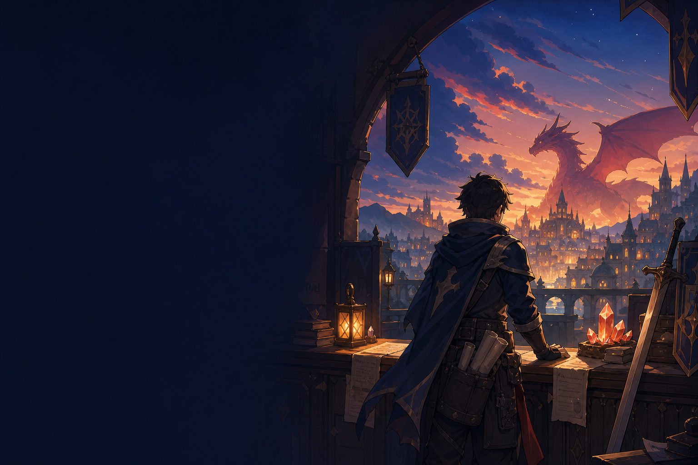

# ⚔️ 猎职勇者团

### DRAGON HUNT CAREER

> 把每一次投递化作讨伐，把每一场面试变成升级，直到赢得属于你的屠龙凭证。

[](https://nextjs.org/)
[](https://react.dev/)
[](https://www.typescriptlang.org/)
[](#使用说明)

</div>

## 🗺️ 项目简介

**猎职勇者团**是一款将求职流程游戏化的本地记录工具。它把公司与岗位变成“讨伐任务”，把一面、二面和终面设计为逐级变强的怪物战场，并将最终获得的 Offer 收藏为“屠龙奖章”。

你可以在这里记录投递、推动面试阶段、整理求职准备事项，并用等级、战绩和攻击力直观看见自己一路积累的经验。

<p align="center">
  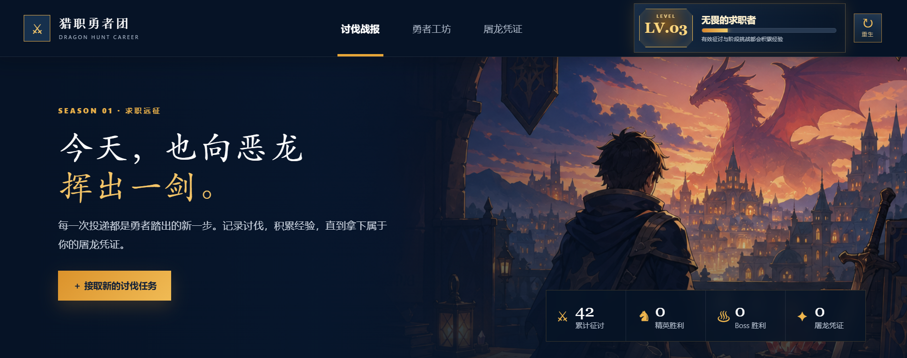
</p>

## 🛡️ 冒险手册

| 冒险区域 | 对应功能 |
| --- | --- |
| 📜 讨伐任务簿 | 记录公司、岗位、投递时间与任务情报，并按日期整理 |
| 🟣 精英战场 | 将任务从投递推进至一面、二面，记录胜利或失败 |
| 🐉 恶龙 BOSS | 管理终面挑战，完成最后一场讨伐 |
| 🔨 勇者工坊 | 规划技能学习、项目练习、公司调研和面试训练 |
| 🏅 屠龙荣誉室 | 将成功获得的 Offer 收藏为屠龙奖章 |
| ⭐ 勇者成长 | 根据投递、面试与备战成果累计等级、战绩和攻击力 |

核心任务记录默认保存在浏览器的 `localStorage` 中，无须注册账号或后端服务；BOSS 职位提取器是按需部署的独立本机组件。

## 📖 冒险实录

截图按照实际操作顺序记录在 `demo` 目录中。下面是一条完整的求职远征路线：接取任务 → 推进面试 → 强化备战 → 赢得 Offer。

<details open>
<summary><strong>第一章 · 接取讨伐任务</strong></summary>
<br />
<p align="center">
  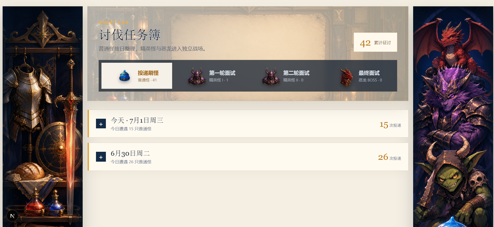
  <br /><br />
  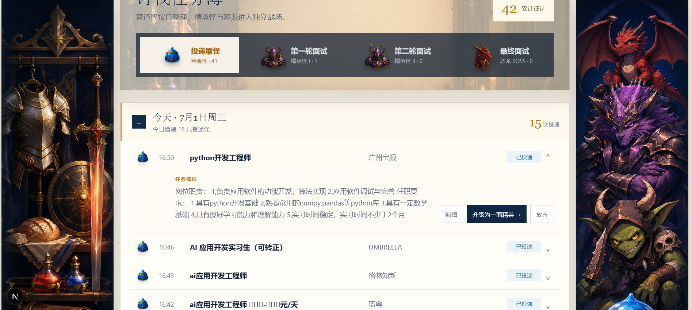
  <br /><br />
  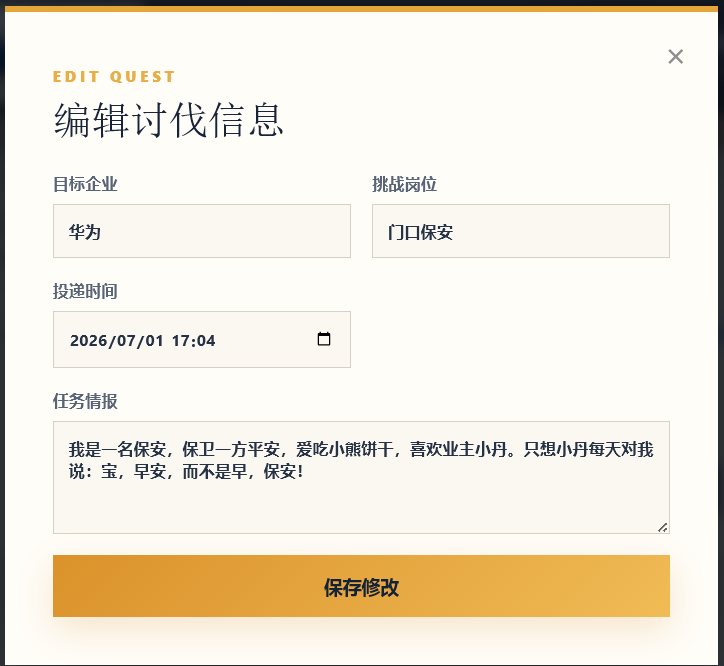
</p>
</details>

<details>
<summary><strong>第二章 · 挑战精英与恶龙</strong></summary>
<br />
<p align="center">
  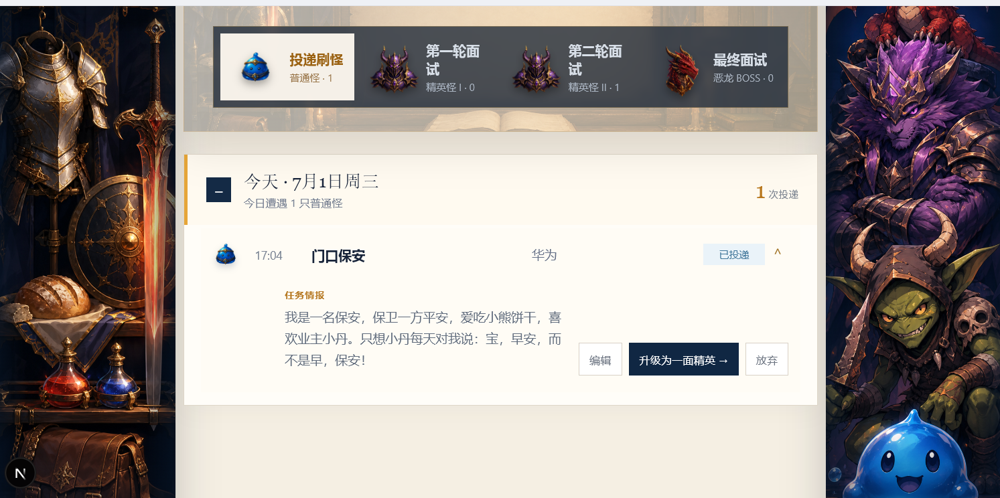
  <br /><br />
  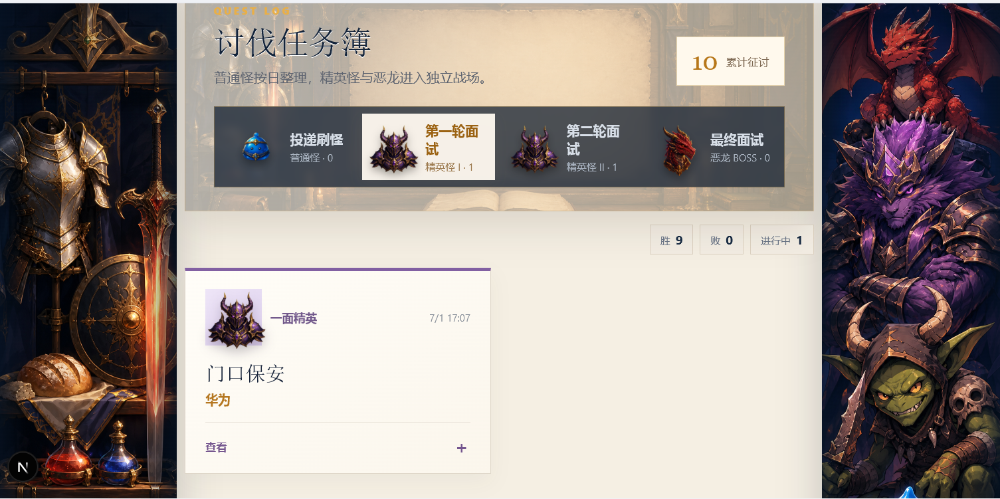
  <br /><br />
  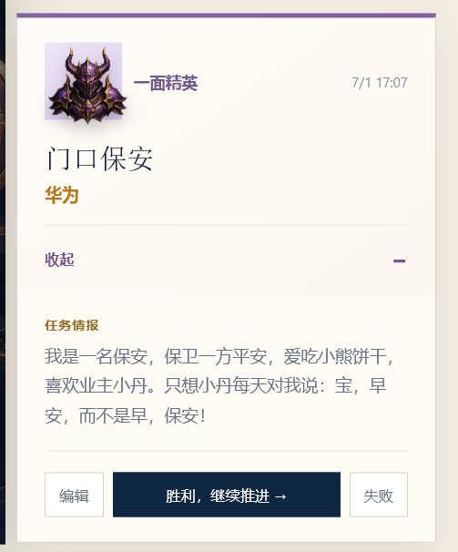
  <br /><br />
  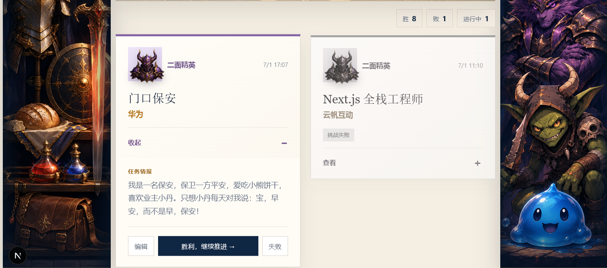
  <br /><br />
  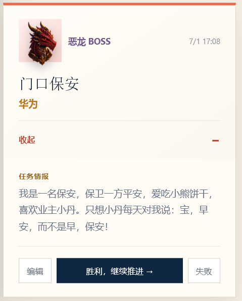
</p>
</details>

<details>
<summary><strong>第三章 · 工坊备战与屠龙荣誉</strong></summary>
<br />
<p align="center">
  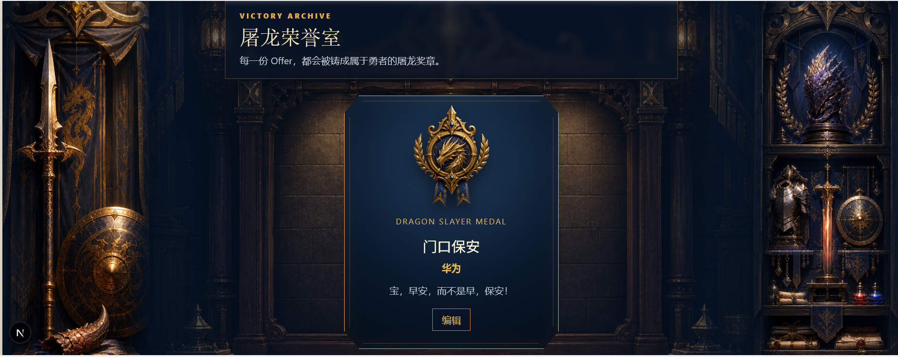
  <br /><br />
  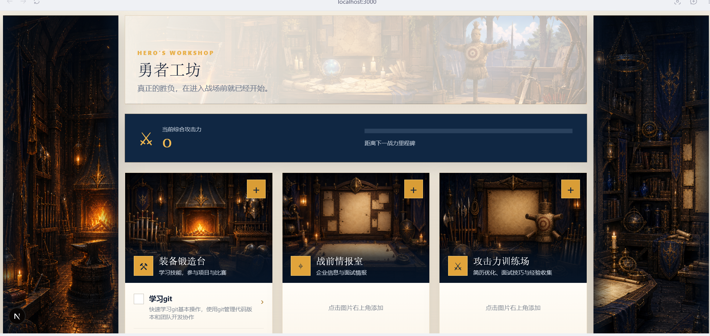
  <br /><br />
  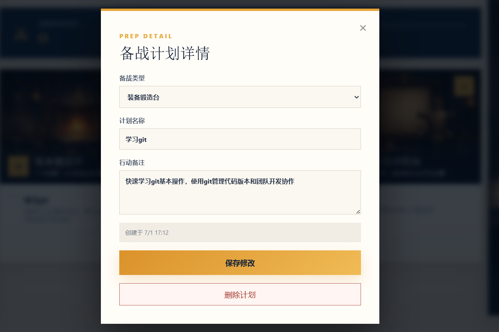
</p>
</details>

## 🔥 点燃篝火：本地运行

### 环境要求

- [Node.js](https://nodejs.org/) `20.9.0` 或更高版本
- npm（随 Node.js 一同安装）

### 安装与启动

```bash
git clone https://github.com/YiCon4213/Job-Hunting-Game.git
cd Job-Hunting-Game
npm install
npm run dev
```

浏览器访问 [http://localhost:3000](http://localhost:3000) 即可开始冒险。

Windows 用户也可以在安装依赖后双击 `start-web.cmd`。脚本会自动在 `3000`–`3099` 中寻找可用端口、启动开发服务器并打开浏览器。

## 🏰 生产构建

```bash
npm run build
npm run start
```

## 🎒 常用命令

| 命令 | 用途 |
| --- | --- |
| `npm run dev` | 启动本地开发服务器 |
| `npm run build` | 创建生产环境构建 |
| `npm run start` | 启动生产服务器 |

## 🧭 项目结构

```text
Job-Hunting-Game/
├─ app/
│  ├─ page.tsx          # 页面、交互逻辑与本地数据管理
│  ├─ layout.tsx        # 页面元信息与全局布局
│  ├─ globals.css       # 主视觉与基础样式
│  └─ extras.css        # 补充组件样式
├─ public/              # 勇者、怪物、工坊及场景美术资源
├─ demo/                # 按操作顺序编号的项目截图
├─ scripts/
│  └─ start-web.ps1     # Windows 一键启动脚本
├─ start-web.cmd        # Windows 启动入口
└─ package.json
```

## ✨ 职位信息提取与导出

- 接取任务时可手动填写薪资；已有薪资会在普通任务、面试战场和荣誉室中显示。
- 在“接取讨伐任务”窗口点击“BOSS 提取器”，先检查本机服务与 Chrome 扩展状态，再粘贴 BOSS 职位详情链接。提取成功后会预填企业、岗位、薪资、任务情报和来源链接，仍需点击“确认出征”才会保存任务。
- 带来源链接的任务会在详情中显示单行省略链接，点击可打开原职位页面。
- 讨伐任务簿的“任务导出”可导出全部记录；填写开始日期和/或结束日期后，按包含边界的日期范围导出 CSV。文件名为 `职位投递-全部.csv` 或对应日期范围，不附加当天日期。
- 如需使用 BOSS 提取器，请前往 [BOSS 职位信息提取助手](https://github.com/YiCon4213/boss-job-extractor)，按该仓库 README 完成部署并启动本机服务；随后在 Chrome 中启用扩展、登录 BOSS 直聘。未部署提取器时，仍可手动录入任务。

## 💾 数据与使用说明

- 所有任务和备战数据仅保存在当前浏览器的本地存储中。
- 清理浏览器站点数据、切换浏览器或更换设备后，记录不会自动同步。
- 页面中的“重生”会清空全部讨伐与备战记录，请谨慎操作。
- 当前项目尚未声明开源许可证；在许可证补充前，请勿默认将代码或美术资源用于再分发及商业用途。

## 🧰 技术栈

- Next.js 16（App Router）
- React 19
- TypeScript 5
- CSS
- Browser Local Storage

## 🤝 加入勇者团

欢迎通过 Issue 提交问题、功能建议或界面反馈，也欢迎 Fork 项目并发起 Pull Request。若要开发新功能，建议先创建独立分支：

```bash
git checkout -b feat/your-adventure
```

<div align="center">

---

**愿每一次投递都有回响，每一场挑战都让你变得更强。**


</div>
